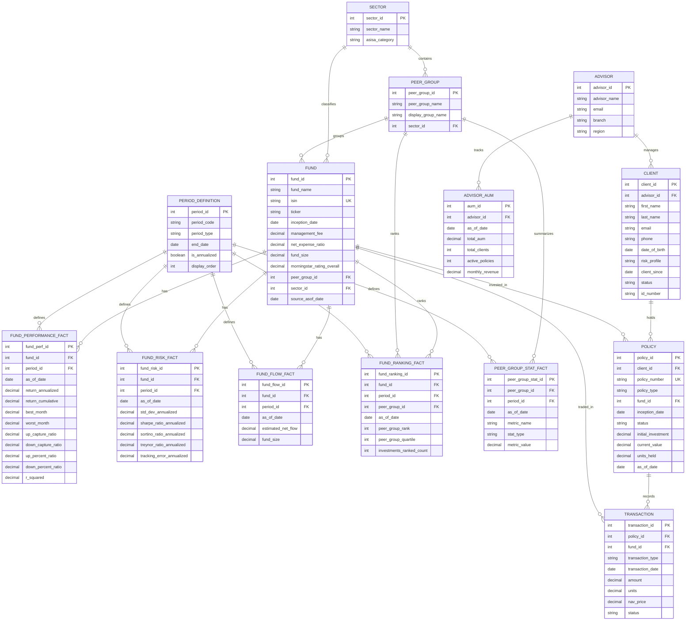

# Investment Advisor CRM — Implementation Plan

> **Goal:** Replace the existing NL-to-SQL Unicorn Companies app with an **Investment Advisor CRM** that lets advisors query their book of business AND research fund performance — all through natural language.

---

## Context

The existing app is a NL→SQL system built for the CB Insights Unicorn dataset (single table). We're replacing it entirely with an Investment Advisor CRM — a tool that helps advisors understand their book of business AND research fund performance, all through natural language queries.

**Two data domains, one interface:**

| Domain | Purpose | Tables |
|--------|---------|--------|
| **Fund Data** | Normalized star schema from ER diagram | 9 tables (sector, peer_group, fund, period_definition, fund_performance_fact, fund_risk_fact, fund_flow_fact, fund_ranking_fact, peer_group_stat_fact) |
| **Client/CRM Data** | Client profiles, policy holdings, transactions, AUM | 5 tables (advisor, client, policy, transaction, advisor_aum) |

Both domains live in the same PostgreSQL DB so NL→SQL works uniformly across all data. The AI system prompt describes all tables and their relationships.

---

## Full Database Schema

### Fund Dimension & Fact Tables (from ER diagram)

```sql
sector (
  sector_id       INT PRIMARY KEY,
  sector_name     VARCHAR(100),
  asisa_category  VARCHAR(100)
);

peer_group (
  peer_group_id       INT PRIMARY KEY,
  peer_group_name     VARCHAR(200),
  display_group_name  VARCHAR(200),
  sector_id           INT REFERENCES sector(sector_id)
);

fund (
  fund_id                    INT PRIMARY KEY,
  fund_name                  VARCHAR(300),
  isin                       VARCHAR(20) UNIQUE,
  ticker                     VARCHAR(20),
  inception_date             DATE,
  management_fee             DECIMAL(6,4),
  net_expense_ratio          DECIMAL(6,4),
  fund_size                  DECIMAL(18,2),
  morningstar_rating_overall DECIMAL(3,1),
  peer_group_id              INT REFERENCES peer_group(peer_group_id),
  sector_id                  INT REFERENCES sector(sector_id),
  source_asof_date           DATE
);

period_definition (
  period_id      INT PRIMARY KEY,
  period_code    VARCHAR(10),
  period_type    VARCHAR(30),
  end_date       DATE,
  is_annualized  BOOLEAN,
  display_order  INT
);

fund_performance_fact (
  fund_perf_id        SERIAL PRIMARY KEY,
  fund_id             INT REFERENCES fund(fund_id),
  period_id           INT REFERENCES period_definition(period_id),
  as_of_date          DATE,
  return_annualized   DECIMAL(10,6),
  return_cumulative   DECIMAL(10,6),
  best_month          DECIMAL(10,6),
  worst_month         DECIMAL(10,6),
  up_capture_ratio    DECIMAL(10,4),
  down_capture_ratio  DECIMAL(10,4),
  up_percent_ratio    DECIMAL(10,4),
  down_percent_ratio  DECIMAL(10,4),
  r_squared           DECIMAL(10,6)
);

fund_risk_fact (
  fund_risk_id              SERIAL PRIMARY KEY,
  fund_id                   INT REFERENCES fund(fund_id),
  period_id                 INT REFERENCES period_definition(period_id),
  as_of_date                DATE,
  std_dev_annualized        DECIMAL(10,6),
  sharpe_ratio_annualized   DECIMAL(10,6),
  sortino_ratio_annualized  DECIMAL(10,6),
  treynor_ratio_annualized  DECIMAL(10,6),
  tracking_error_annualized DECIMAL(10,6)
);

fund_flow_fact (
  fund_flow_id        SERIAL PRIMARY KEY,
  fund_id             INT REFERENCES fund(fund_id),
  period_id           INT REFERENCES period_definition(period_id),
  as_of_date          DATE,
  estimated_net_flow  DECIMAL(18,2),
  fund_size           DECIMAL(18,2)
);

fund_ranking_fact (
  fund_ranking_id         SERIAL PRIMARY KEY,
  fund_id                 INT REFERENCES fund(fund_id),
  period_id               INT REFERENCES period_definition(period_id),
  peer_group_id           INT REFERENCES peer_group(peer_group_id),
  as_of_date              DATE,
  peer_group_rank         INT,
  peer_group_quartile     INT,
  investments_ranked_count INT
);

peer_group_stat_fact (
  peer_group_stat_id  SERIAL PRIMARY KEY,
  peer_group_id       INT REFERENCES peer_group(peer_group_id),
  period_id           INT REFERENCES period_definition(period_id),
  as_of_date          DATE,
  metric_name         VARCHAR(100),
  stat_type           VARCHAR(50),
  metric_value        DECIMAL(18,6)
);
```

### CRM Tables (mock of external APIs — wired to real APIs later)

```sql
advisor (
  advisor_id    SERIAL PRIMARY KEY,
  advisor_name  VARCHAR(100),
  email         VARCHAR(200),
  branch        VARCHAR(100),
  region        VARCHAR(100)
);

client (
  client_id     SERIAL PRIMARY KEY,
  advisor_id    INT REFERENCES advisor(advisor_id),
  first_name    VARCHAR(100),
  last_name     VARCHAR(100),
  email         VARCHAR(200),
  phone         VARCHAR(20),
  date_of_birth DATE,
  risk_profile  VARCHAR(20),    -- conservative, moderate, aggressive
  client_since  DATE,
  status        VARCHAR(20),    -- active, dormant, inactive
  id_number     VARCHAR(20)
);

policy (
  policy_id          SERIAL PRIMARY KEY,
  client_id          INT REFERENCES client(client_id),
  policy_number      VARCHAR(30) UNIQUE,
  policy_type        VARCHAR(30),  -- RA, TFSA, Living Annuity, Endowment, Unit Trust
  fund_id            INT REFERENCES fund(fund_id),
  inception_date     DATE,
  status             VARCHAR(20),
  initial_investment DECIMAL(18,2),
  current_value      DECIMAL(18,2),
  units_held         DECIMAL(18,6),
  as_of_date         DATE
);

transaction (
  transaction_id    SERIAL PRIMARY KEY,
  policy_id         INT REFERENCES policy(policy_id),
  fund_id           INT REFERENCES fund(fund_id),
  transaction_type  VARCHAR(20),  -- contribution, withdrawal, switch_in, switch_out, dividend
  transaction_date  DATE,
  amount            DECIMAL(18,2),
  units             DECIMAL(18,6),
  nav_price         DECIMAL(10,4),
  status            VARCHAR(20)
);

advisor_aum (
  aum_id           SERIAL PRIMARY KEY,
  advisor_id       INT REFERENCES advisor(advisor_id),
  as_of_date       DATE,
  total_aum        DECIMAL(18,2),
  total_clients    INT,
  active_policies  INT,
  monthly_revenue  DECIMAL(18,2)
);
```

### Enum / Domain Values

| Field | Allowed Values |
|-------|---------------|
| `policy.policy_type` | RA (Retirement Annuity), TFSA, Living Annuity, Endowment, Unit Trust |
| `transaction.transaction_type` | contribution, withdrawal, switch_in, switch_out, dividend |
| `client.risk_profile` | conservative, moderate, aggressive |
| `client.status` | active, dormant, inactive |

---

## ER Diagram (Mermaid)



---

## Files to Modify

### 1. `lib/seed.ts` — Full Rewrite

**Current:** Creates a single `unicorns` table and seeds from `unicorns.csv`.

**New:** Drop & recreate all 14 tables in FK order, then seed with realistic South African fund universe sample data.

#### Seed Data Volumes

| Entity | Count |
|--------|-------|
| Sectors | 5 (SA Equity, Fixed Income, Multi-Asset, Money Market, Real Estate) |
| Peer Groups | 10 (SA Equity General, SA Equity Large Cap, SA Multi-Asset High Equity, etc.) |
| Funds | 30 (with ISIN codes, tickers, fees, Morningstar ratings) |
| Period Definitions | 8 (1M, 3M, 6M, 1Y, 3Y, 5Y, 10Y, SI) |
| Fund Performance Facts | ~240 (30 funds × 8 periods) |
| Fund Risk Facts | ~240 (30 funds × 8 periods) |
| Fund Flow Facts | ~240 (30 funds × 8 periods) |
| Fund Ranking Facts | ~240 (30 funds × 8 periods) |
| Peer Group Stat Facts | ~80 (10 peer groups × 8 periods) |
| Advisors | 5 |
| Clients | 50 |
| Policies | 80 |
| Transactions | 200 |
| Advisor AUM Snapshots | ~15 (5 advisors × 3 months) |

#### Drop Order (reverse FK dependency)
```
transaction → policy → advisor_aum → client → advisor →
peer_group_stat_fact → fund_ranking_fact → fund_flow_fact →
fund_risk_fact → fund_performance_fact → fund →
period_definition → peer_group → sector → dashboard_insights
```

#### Create Order (forward FK dependency)
```
sector → peer_group → period_definition → fund →
fund_performance_fact → fund_risk_fact → fund_flow_fact →
fund_ranking_fact → peer_group_stat_fact →
advisor → client → policy → transaction → advisor_aum →
dashboard_insights
```

---

### 2. `app/actions.ts` — Update System Prompt in `generateQuery()`

**Current:** System prompt describes the single `unicorns` table.

**New:** Replace with full 14-table schema description and AI guidance.

#### AI Guidance to Include

| Topic | Guidance |
|-------|----------|
| JOIN paths | `policy → client → advisor`; `policy → fund → peer_group → sector` |
| Period filtering | Always JOIN `period_definition` on `period_code` (e.g., `'1Y'`, `'3Y'`) |
| Decimals | Returns are fractions (0.12 = 12%), fees are fractions (0.015 = 1.5%) |
| Rankings | Lower `peer_group_rank` = better; quartile 1 = top quartile |
| Flows | Positive `estimated_net_flow` = net inflow, negative = net outflow |
| Currency | AUM/current_value/amounts in South African Rands (ZAR) |
| Charting | Always return quantitative data suitable for charting (≥ 2 columns) |
| Cross-domain | Example pattern: "clients holding top-quartile funds" requires JOIN across CRM + fund tables |

Also update `explainQuery()` system prompt to reference the new schema and update `runGenerateSQLQuery()` error message to not reference unicorns.

---

### 3. `lib/insights.ts` — Replace Unicorn Insights with Two Insight Categories

**Current:** 7 unicorn-focused insight queries (top industries, countries, cities, investors, etc.)

**New:** Replace with two categories of insights:

#### Book of Business Insights (Advisor-Centric)

| Insight | Chart Type | SQL Summary |
|---------|-----------|-------------|
| Total AUM and client count across all advisors | KPI cards | `SUM(total_aum)`, `SUM(total_clients)` from `advisor_aum` |
| AUM by advisor | Bar chart | `advisor_aum` JOIN `advisor` |
| Client breakdown by risk profile | Pie chart | `COUNT(*) GROUP BY risk_profile` from `client` |
| Policy type distribution | Pie chart | `COUNT(*) GROUP BY policy_type` from `policy` |
| Top 10 clients by current portfolio value | Ranked list | `SUM(current_value)` from `policy` JOIN `client` |
| Transaction activity by month | Line chart | `COUNT(*), SUM(amount) GROUP BY month` from `transaction` |
| At-risk clients (dormant/inactive) | Ranked list | `WHERE status IN ('dormant', 'inactive')` from `client` |

#### Fund Analytics Insights

| Insight | Chart Type | SQL Summary |
|---------|-----------|-------------|
| Top 10 funds by 1Y return | Bar chart | `fund_performance_fact` JOIN `period_definition` WHERE `period_code = '1Y'` |
| Average Sharpe ratio by sector | Bar chart | `fund_risk_fact` JOIN `fund` JOIN `sector` |
| Net fund flows by peer group | Bar chart | `fund_flow_fact` JOIN `fund` JOIN `peer_group` |
| Quartile distribution by peer group | Stacked bar | `fund_ranking_fact` GROUP BY `peer_group`, `quartile` |
| Risk vs return scatter | Scatter (bar fallback) | `std_dev_annualized` vs `return_annualized` |
| Morningstar rating distribution | Pie chart | `COUNT(*) GROUP BY morningstar_rating_overall` from `fund` |

#### Updated Types

```typescript
export interface DashboardInsights {
  kpis: KpiData;
  // Book of Business
  aum_by_advisor: InsightPayload<AumByAdvisorRow[]>;
  risk_profile_breakdown: InsightPayload<RiskProfileRow[]>;
  policy_type_distribution: InsightPayload<PolicyTypeRow[]>;
  top_clients: InsightPayload<TopClientRow[]>;
  transaction_activity: InsightPayload<TransactionActivityRow[]>;
  at_risk_clients: InsightPayload<AtRiskClientRow[]>;
  // Fund Analytics
  top_funds_1y: InsightPayload<TopFundRow[]>;
  sharpe_by_sector: InsightPayload<SharpeBySectorRow[]>;
  flows_by_peer_group: InsightPayload<FlowsByPeerGroupRow[]>;
  quartile_distribution: InsightPayload<QuartileDistributionRow[]>;
  morningstar_distribution: InsightPayload<MorningstarRow[]>;
  narrative: string;
}
```

---

### 4. `app/dashboard/page.tsx` and Dashboard Components

**Current:** Renders unicorn KPIs, industry/country/city charts, geo distribution, and ranked lists.

**New:**
- Add two tabs: **"Book of Business"** and **"Fund Analytics"** (using existing `@radix-ui/react-tabs`)
- Update page title to "Investment Advisor CRM"
- Update subtitle to reflect dual-domain capability
- Replace all unicorn-specific KPI cards with new CRM & fund KPIs
- Replace chart components with new insight data

#### Updated KPI Cards
| Card | Source |
|------|--------|
| Total AUM | `advisor_aum` |
| Total Clients | `advisor_aum` |
| Active Policies | `advisor_aum` |
| Total Funds | `fund` count |
| Avg 1Y Return | `fund_performance_fact` |
| Monthly Revenue | `advisor_aum` |

#### Dashboard Components to Update
- `KpiCard.tsx` — no structural changes, just new data
- `InsightChart.tsx` — no structural changes, just new data
- `RankedList.tsx` — no structural changes, just new data items
- `NarrativeSummary.tsx` — no changes
- `RefreshButton.tsx` — no changes
- `GeoDistribution.tsx` — **may remove or repurpose** (no geo data in new schema)
- **New:** Consider a `TabContainer` wrapper or use Radix Tabs directly in `page.tsx`

---

### 5. `app/query/page.tsx` — Update Labels & Placeholders

**Current:** "Ask any question about the unicorn companies database"

**New:**
- Title: "Natural Language Query" (keep)
- Subtitle: "Ask about your clients, their portfolios, or fund performance in plain English."

---

### 6. `components/suggested-queries.tsx` — Replace Suggestion Queries

**Current:** Unicorn-themed queries (SF vs NY, US vs China, etc.)

**New:**
```typescript
const suggestionQueries = [
  { desktop: "Who are my top 10 clients by total portfolio value?", mobile: "Top clients" },
  { desktop: "Which funds have the best Sharpe ratio over 3 years?", mobile: "Best Sharpe" },
  { desktop: "Show AUM breakdown by advisor", mobile: "AUM by advisor" },
  { desktop: "Compare 1Y returns across SA Equity funds", mobile: "1Y returns" },
  { desktop: "Which clients hold funds in the bottom quartile?", mobile: "Bottom quartile" },
  { desktop: "Show transaction activity over the last 6 months", mobile: "Transactions" },
  { desktop: "What is the policy type distribution across all clients?", mobile: "Policy types" },
  { desktop: "Show net fund flows by peer group", mobile: "Fund flows" },
  { desktop: "List dormant clients with their total portfolio value", mobile: "Dormant clients" },
  { desktop: "Compare risk vs return for all funds over 1 year", mobile: "Risk vs return" },
  { desktop: "Which advisors manage the most AUM?", mobile: "Top advisors" },
];
```

---

## What Does NOT Change

| File / Component | Why |
|-----------------|-----|
| `runGenerateSQLQuery()` in `app/actions.ts` | Schema-agnostic SQL execution (minor: update error message) |
| `generateChartConfig()` in `app/actions.ts` | Schema-agnostic — works off result data |
| `explainQuery()` in `app/actions.ts` | Schema-agnostic structure (update system prompt only) |
| `lib/types.ts` | `Config`/`Result` types are generic; only `Unicorn` type removed |
| All `components/ui/*` | shadcn primitives, no domain logic |
| `components/dynamic-chart.tsx` | Fully generic — renders any `Config` |
| `components/results.tsx` | Fully generic — renders any `Result[]` |
| `components/search.tsx` | Generic search input |
| `components/query-viewer.tsx` | Generic SQL display |
| `lib/llm.ts` | LLM model config (unchanged) |
| `lib/utils.ts` | `cn()` utility (unchanged) |
| `lib/rechart-format.ts` | Chart formatting (unchanged) |

---

## Implementation Order

```
1. lib/seed.ts         → Defines all 14 tables + sample data
2. app/actions.ts      → Update system prompt to describe all 14 tables
3. lib/insights.ts     → Replace insights with fund + CRM queries
4. lib/types.ts        → Remove Unicorn type (minor)
5. components/suggested-queries.tsx → Update query suggestions
6. app/dashboard/page.tsx → Add Book of Business / Fund Analytics tabs
7. app/query/page.tsx  → Update labels/placeholders
```

---

## Verification Plan

### Automated

| Test | Command/Action |
|------|---------------|
| Seed runs clean | `pnpm run seed` — all 14 tables created, populated, no errors |
| Build succeeds | `pnpm build` — no TypeScript errors |

### Manual (via `/query` page)

| Query | Expected Behavior |
|-------|-------------------|
| "Who are my top clients by AUM?" | Valid SQL across `advisor` + `client` + `policy` tables |
| "Which funds have the best Sharpe ratio over 3 years?" | JOINs `fund_risk_fact` + `period_definition` WHERE `period_code = '3Y'` |
| "Show clients holding funds in the bottom quartile" | Cross-domain JOIN across CRM + fund ranking tables |
| "What is the total AUM by advisor?" | JOINs `advisor_aum` + `advisor` |

### Dashboard Verification

- `/dashboard` — Both "Book of Business" and "Fund Analytics" sections render with charts
- KPI cards show correct aggregated values
- All charts render without errors
- Refresh button regenerates insights successfully

---

## Future: Real API Integration

When external client/policy APIs are ready:

1. Add an API fetch layer in `lib/client-api.ts`
2. The `generateQuery()` action could be extended to route client queries to the API instead of (or in addition to) SQL
3. Alternatively, keep syncing API data into the DB periodically so NL→SQL continues to work uniformly
4. The `policy.fund_id` FK links real client data to the fund analytics domain seamlessly

---

## Risk & Considerations

| Risk | Mitigation |
|------|-----------|
| Seed data volume (1000+ rows across 14 tables) | Use bulk INSERT with `VALUES` lists rather than individual queries |
| LLM prompt length (14-table schema) | Keep schema description concise; use abbreviated column descriptions |
| Cross-domain JOINs complexity | Include explicit JOIN path examples in the system prompt |
| Dashboard insight generation time | Run all SQL queries in parallel, then LLM captions in parallel (existing pattern) |
| Existing dashboard components assume unicorn data shapes | Update types in `insights.ts`; component interfaces are generic enough |
