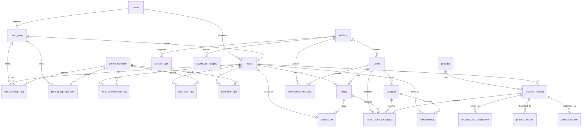

# Database Schema

PostgreSQL schema backing the Investment Advisor CRM. All tables live in the default `public` schema. The seeding script (`lib/seed.ts`) drops and recreates every table on each run.

The database groups into five domains:

1. **Reference / dimension data** — `sector`, `peer_group`, `period_definition`
2. **Fund master + fact tables** — `fund`, `fund_performance_fact`, `fund_risk_fact`, `fund_flow_fact`, `fund_ranking_fact`, `peer_group_stat_fact`
3. **CRM / client book** — `advisor`, `client`, `policy`, `transaction`, `advisor_aum`
4. **Wrapper / holdings** — `wrapper`, `fund_holding`
5. **Product catalogue + operational** — `provider`, `provider_product`, `product_cost_component`, `product_feature`, `product_source`, `client_product_mapping`, `communication_drafts`, `dashboard_insights`

## Conventions

- All monetary amounts are in **South African Rands (ZAR)**.
- Returns and fees are stored as **decimal fractions**: `0.12` = 12%, `0.0085` = 0.85%.
- `fund_holding.allocation_pct` and `wrapper.drawdown_rate_pct` are fractions (`0.075` = 7.5%).
- `peer_group_quartile`: `1` = top, `4` = bottom. Lower `peer_group_rank` is better.
- `as_of_date` columns: seeded snapshot is `2024-12-31`.
- `estimated_net_flow`: positive = inflow, negative = outflow.

---

## 1. Reference / Dimension Tables

### `sector`
Top-level ASISA asset-class grouping.

| Column          | Type          | Notes                          |
|-----------------|---------------|--------------------------------|
| `sector_id`     | `INT`         | **PK** (not serial — seeded 1–5) |
| `sector_name`   | `VARCHAR(100)`| e.g. `SA Equity`, `Fixed Income`, `Multi-Asset`, `Money Market`, `Real Estate` |
| `asisa_category`| `VARCHAR(100)`| e.g. `Domestic Equity`, `Domestic Asset Allocation` |

### `peer_group`
ASISA peer grouping inside a sector (e.g. "SA Multi-Asset High Equity").

| Column               | Type           | Notes                                    |
|----------------------|----------------|------------------------------------------|
| `peer_group_id`      | `INT`          | **PK**                                   |
| `peer_group_name`    | `VARCHAR(200)` | Full ASISA name                          |
| `display_group_name` | `VARCHAR(200)` | Shortened label for UI                   |
| `sector_id`          | `INT`          | **FK** → `sector.sector_id`              |

### `period_definition`
Canonical reporting windows. Every fact joins here on `period_id`.

| Column          | Type         | Notes                                    |
|-----------------|--------------|------------------------------------------|
| `period_id`     | `INT`        | **PK**                                   |
| `period_code`   | `VARCHAR(10)`| `1M`, `3M`, `6M`, `1Y`, `3Y`, `5Y`, `10Y`, `SI` |
| `period_type`   | `VARCHAR(30)`| `calendar_month`, `trailing_1_year`, `since_inception`, … |
| `end_date`      | `DATE`       | Snapshot end (seeded `2024-12-31`)       |
| `is_annualized` | `BOOLEAN`    | True for `1Y+` and `SI`                  |
| `display_order` | `INT`        | UI sort order                            |

Seeded values: `(1,'1M')`, `(2,'3M')`, `(3,'6M')`, `(4,'1Y')`, `(5,'3Y')`, `(6,'5Y')`, `(7,'10Y')`, `(8,'SI')`.

---

## 2. Fund Master + Fact Tables

### `fund`
Master record per unit trust.

| Column                       | Type           | Notes                                       |
|------------------------------|----------------|---------------------------------------------|
| `fund_id`                    | `INT`          | **PK**                                      |
| `fund_name`                  | `VARCHAR(300)` |                                             |
| `isin`                       | `VARCHAR(20)`  | **UNIQUE**                                  |
| `ticker`                     | `VARCHAR(20)`  |                                             |
| `inception_date`             | `DATE`         |                                             |
| `management_fee`             | `DECIMAL(6,4)` | Fraction (`0.0085` = 0.85%)                 |
| `net_expense_ratio`          | `DECIMAL(6,4)` | Fraction                                    |
| `fund_size`                  | `DECIMAL(18,2)`| Total AUM for fund, ZAR                     |
| `morningstar_rating_overall` | `DECIMAL(3,1)` | 1.0–5.0                                     |
| `peer_group_id`              | `INT`          | **FK** → `peer_group.peer_group_id`         |
| `sector_id`                  | `INT`          | **FK** → `sector.sector_id`                 |
| `source_asof_date`           | `DATE`         |                                             |

### `fund_performance_fact`
Return metrics per fund × period.

| Column               | Type           | Notes                                       |
|----------------------|----------------|---------------------------------------------|
| `fund_perf_id`       | `SERIAL`       | **PK**                                      |
| `fund_id`            | `INT`          | **FK** → `fund`                             |
| `period_id`          | `INT`          | **FK** → `period_definition`                |
| `as_of_date`         | `DATE`         |                                             |
| `return_annualized`  | `DECIMAL(10,6)`| Fraction                                    |
| `return_cumulative`  | `DECIMAL(10,6)`| Fraction                                    |
| `best_month`         | `DECIMAL(10,6)`| Fraction                                    |
| `worst_month`        | `DECIMAL(10,6)`| Fraction                                    |
| `up_capture_ratio`   | `DECIMAL(10,4)`|                                             |
| `down_capture_ratio` | `DECIMAL(10,4)`|                                             |
| `up_percent_ratio`   | `DECIMAL(10,4)`|                                             |
| `down_percent_ratio` | `DECIMAL(10,4)`|                                             |
| `r_squared`          | `DECIMAL(10,6)`|                                             |

### `fund_risk_fact`
Risk-adjusted metrics per fund × period.

| Column                      | Type           | Notes                  |
|-----------------------------|----------------|------------------------|
| `fund_risk_id`              | `SERIAL`       | **PK**                 |
| `fund_id`                   | `INT`          | **FK** → `fund`        |
| `period_id`                 | `INT`          | **FK** → `period_definition` |
| `as_of_date`                | `DATE`         |                        |
| `std_dev_annualized`        | `DECIMAL(10,6)`| Fraction               |
| `sharpe_ratio_annualized`   | `DECIMAL(10,6)`|                        |
| `sortino_ratio_annualized`  | `DECIMAL(10,6)`|                        |
| `treynor_ratio_annualized`  | `DECIMAL(10,6)`|                        |
| `tracking_error_annualized` | `DECIMAL(10,6)`|                        |

### `fund_flow_fact`
Estimated flows and size per fund × period.

| Column               | Type            | Notes                          |
|----------------------|-----------------|--------------------------------|
| `fund_flow_id`       | `SERIAL`        | **PK**                         |
| `fund_id`            | `INT`           | **FK** → `fund`                |
| `period_id`          | `INT`           | **FK** → `period_definition`   |
| `as_of_date`         | `DATE`          |                                |
| `estimated_net_flow` | `DECIMAL(18,2)` | ZAR (+ inflow / − outflow)     |
| `fund_size`          | `DECIMAL(18,2)` | ZAR                            |

### `fund_ranking_fact`
Peer-group ranking per fund × period.

| Column                     | Type   | Notes                                  |
|----------------------------|--------|----------------------------------------|
| `fund_ranking_id`          | `SERIAL` | **PK**                               |
| `fund_id`                  | `INT`  | **FK** → `fund`                        |
| `period_id`                | `INT`  | **FK** → `period_definition`           |
| `peer_group_id`            | `INT`  | **FK** → `peer_group`                  |
| `as_of_date`               | `DATE` |                                        |
| `peer_group_rank`          | `INT`  | 1 is best                              |
| `peer_group_quartile`      | `INT`  | 1 = top, 4 = bottom                    |
| `investments_ranked_count` | `INT`  | Universe size for the ranking          |

### `peer_group_stat_fact`
Aggregated statistics for a peer group (long format).

| Column                | Type           | Notes                                   |
|-----------------------|----------------|-----------------------------------------|
| `peer_group_stat_id`  | `SERIAL`       | **PK**                                  |
| `peer_group_id`       | `INT`          | **FK** → `peer_group`                   |
| `period_id`           | `INT`          | **FK** → `period_definition`            |
| `as_of_date`          | `DATE`         |                                         |
| `metric_name`         | `VARCHAR(100)` | e.g. `return_annualized`, `std_dev`     |
| `stat_type`           | `VARCHAR(50)`  | e.g. `median`, `average`, `quartile_1`  |
| `metric_value`        | `DECIMAL(18,6)`|                                         |

---

## 3. CRM Tables

### `advisor`

| Column         | Type           | Notes            |
|----------------|----------------|------------------|
| `advisor_id`   | `SERIAL`       | **PK**           |
| `advisor_name` | `VARCHAR(100)` |                  |
| `email`        | `VARCHAR(200)` |                  |
| `branch`       | `VARCHAR(100)` |                  |
| `region`       | `VARCHAR(100)` |                  |

### `client`

| Column                  | Type           | Notes                                       |
|-------------------------|----------------|---------------------------------------------|
| `client_id`             | `SERIAL`       | **PK**                                      |
| `advisor_id`            | `INT`          | **FK** → `advisor`                          |
| `first_name`            | `VARCHAR(100)` |                                             |
| `last_name`             | `VARCHAR(100)` |                                             |
| `email`                 | `VARCHAR(200)` |                                             |
| `phone`                 | `VARCHAR(20)`  |                                             |
| `date_of_birth`         | `DATE`         |                                             |
| `risk_profile`          | `VARCHAR(20)`  | `conservative` \| `moderate` \| `aggressive` |
| `client_since`          | `DATE`         |                                             |
| `status`                | `VARCHAR(20)`  | `active` \| `dormant` \| `inactive`         |
| `id_number`             | `VARCHAR(20)`  | SA ID number                                |
| `annual_income`         | `DECIMAL(14,2)`| ZAR                                         |
| `target_retirement_age` | `INT`          |                                             |
| `annual_income_need`    | `DECIMAL(14,2)`| ZAR; expected income in retirement          |

### `policy`
One row per client × fund line item. Older "flat" view of holdings; kept in sync with the wrapper model.

| Column               | Type           | Notes                                                         |
|----------------------|----------------|---------------------------------------------------------------|
| `policy_id`          | `SERIAL`       | **PK**                                                        |
| `client_id`          | `INT`          | **FK** → `client`                                             |
| `policy_number`      | `VARCHAR(30)`  | **UNIQUE**                                                    |
| `policy_type`        | `VARCHAR(30)`  | `RA` \| `TFSA` \| `Living Annuity` \| `Endowment` \| `Unit Trust` |
| `fund_id`            | `INT`          | **FK** → `fund`                                               |
| `inception_date`     | `DATE`         |                                                               |
| `status`             | `VARCHAR(20)`  | `active` \| `paid_up` \| `lapsed`                             |
| `initial_investment` | `DECIMAL(18,2)`| ZAR                                                           |
| `current_value`      | `DECIMAL(18,2)`| ZAR                                                           |
| `units_held`         | `DECIMAL(18,6)`|                                                               |
| `as_of_date`         | `DATE`         |                                                               |

### `transaction`
Contribution / withdrawal / switch activity on a policy.

| Column             | Type            | Notes                                                                 |
|--------------------|-----------------|-----------------------------------------------------------------------|
| `transaction_id`   | `SERIAL`        | **PK**                                                                |
| `policy_id`        | `INT`           | **FK** → `policy`                                                     |
| `fund_id`          | `INT`           | **FK** → `fund`                                                       |
| `transaction_type` | `VARCHAR(20)`   | `contribution` \| `withdrawal` \| `switch_in` \| `switch_out` \| `dividend` |
| `transaction_date` | `DATE`          |                                                                       |
| `amount`           | `DECIMAL(18,2)` | ZAR                                                                   |
| `units`            | `DECIMAL(18,6)` |                                                                       |
| `nav_price`        | `DECIMAL(10,4)` |                                                                       |
| `status`           | `VARCHAR(20)`   | `settled` \| `pending` \| `failed`                                    |

### `advisor_aum`
Daily snapshot of an advisor's book totals.

| Column            | Type            | Notes                |
|-------------------|-----------------|----------------------|
| `aum_id`          | `SERIAL`        | **PK**               |
| `advisor_id`      | `INT`           | **FK** → `advisor`   |
| `as_of_date`      | `DATE`          |                      |
| `total_aum`       | `DECIMAL(18,2)` | ZAR                  |
| `total_clients`   | `INT`           |                      |
| `active_policies` | `INT`           |                      |
| `monthly_revenue` | `DECIMAL(18,2)` | ZAR                  |

---

## 4. Wrapper / Holdings Tables

### `wrapper`
A legal / tax container held by a client (RA, TFSA, Living Annuity, etc.). Acts as the parent for fund holdings.

| Column                  | Type            | Notes                                                                                                        |
|-------------------------|-----------------|--------------------------------------------------------------------------------------------------------------|
| `wrapper_id`            | `INT`           | **PK**                                                                                                       |
| `client_id`             | `INT`           | **FK** → `client`                                                                                            |
| `wrapper_type`          | `VARCHAR(40)`   | `retirement_annuity` \| `tfsa` \| `endowment` \| `living_annuity` \| `preservation_fund` \| `unit_trust` \| `guaranteed_annuity` |
| `wrapper_number`        | `VARCHAR(30)`   | **UNIQUE**                                                                                                   |
| `phase`                 | `VARCHAR(20)`   | `accumulation` (still investing) \| `drawdown` (drawing income)                                              |
| `status`                | `VARCHAR(20)`   | `active` \| `paid_up` \| `lapsed`                                                                            |
| `inception_date`        | `DATE`          |                                                                                                              |
| `total_current_value`   | `DECIMAL(18,2)` | ZAR                                                                                                          |
| `monthly_contribution`  | `DECIMAL(14,2)` | ZAR; non-zero during accumulation                                                                            |
| `drawdown_rate_pct`     | `DECIMAL(6,4)`  | Fraction; only meaningful for `living_annuity`. ≤5% sustainable, 5–7.5% amber, >7.5% depletion risk          |
| `monthly_income`        | `DECIMAL(14,2)` | ZAR; non-zero during drawdown                                                                                |
| `beneficiary_nominated` | `BOOLEAN`       | False triggers "missing beneficiary" alert                                                                   |
| `as_of_date`            | `DATE`          |                                                                                                              |

### `fund_holding`
Individual fund position inside a wrapper. Sum of `allocation_pct` within a wrapper should be 1.0.

| Column           | Type            | Notes                                |
|------------------|-----------------|--------------------------------------|
| `holding_id`     | `INT`           | **PK**                               |
| `wrapper_id`     | `INT`           | **FK** → `wrapper`                   |
| `fund_id`        | `INT`           | **FK** → `fund`                      |
| `allocation_pct` | `DECIMAL(8,6)`  | Fraction of wrapper (0–1)            |
| `current_value`  | `DECIMAL(18,2)` | ZAR                                  |
| `units_held`     | `DECIMAL(18,6)` |                                      |
| `inception_date` | `DATE`          |                                      |
| `as_of_date`     | `DATE`          |                                      |

---

## 5. Product Catalogue + Operational Tables

Defined in `lib/cockpit-storage.ts` (`ensureProductCatalogTables`, `ensureCockpitTables`). Created with `IF NOT EXISTS` so re-seeds don't lose data.

### `provider`
Insurer / LISP / asset manager that sells retail products.

| Column          | Type          | Notes                                           |
|-----------------|---------------|-------------------------------------------------|
| `provider_id`   | `INT`         | **PK**                                          |
| `provider_name` | `VARCHAR(120)`| **NOT NULL**                                    |
| `provider_type` | `VARCHAR(32)` | **NOT NULL** (e.g. `lisp`, `insurer`, `manco`)  |
| `website_url`   | `TEXT`        |                                                 |
| `active`        | `BOOLEAN`     | **NOT NULL DEFAULT TRUE**                       |

Index: `provider_type_name_idx (provider_type, provider_name)`.

### `provider_product`
Retail wrapper / fund product offered by a provider.

| Column                | Type           | Notes                                                             |
|-----------------------|----------------|-------------------------------------------------------------------|
| `product_id`          | `INT`          | **PK**                                                            |
| `provider_id`         | `INT`          | **FK** → `provider` `ON DELETE CASCADE`                           |
| `reference_fund_id`   | `INT`          | **FK** → `fund` `ON DELETE SET NULL`                              |
| `product_name`        | `VARCHAR(220)` | **NOT NULL**                                                      |
| `product_family`      | `VARCHAR(80)`  | **NOT NULL**                                                      |
| `product_type`        | `VARCHAR(80)`  | **NOT NULL**                                                      |
| `vehicle_type`        | `VARCHAR(80)`  | **NOT NULL**                                                      |
| `comparison_group`    | `VARCHAR(120)` | **NOT NULL**                                                      |
| `risk_band`           | `VARCHAR(32)`  | **NOT NULL**                                                      |
| `target_market`       | `TEXT`         |                                                                   |
| `minimum_investment`  | `DECIMAL(18,2)`| ZAR lump sum                                                      |
| `minimum_debit_order` | `DECIMAL(18,2)`| ZAR monthly                                                       |
| `source_asof_date`    | `DATE`         |                                                                   |
| `eac_confidence`      | `VARCHAR(16)`  | **NOT NULL DEFAULT `'medium'`** — quality of EAC inputs           |
| `active`              | `BOOLEAN`      | **NOT NULL DEFAULT TRUE**                                         |

Index: `provider_product_provider_group_idx (provider_id, comparison_group, active)`.

### `product_cost_component`
Breakdown of the EAC (Effective Annual Cost) for a product.

| Column               | Type           | Notes                                                   |
|----------------------|----------------|---------------------------------------------------------|
| `component_id`       | `SERIAL`       | **PK**                                                  |
| `product_id`         | `INT`          | **FK** → `provider_product` `ON DELETE CASCADE`         |
| `component_type`     | `VARCHAR(64)`  | **NOT NULL** (e.g. `investment_management_fee`, `admin`) |
| `charge_basis`       | `VARCHAR(32)`  | **NOT NULL** (e.g. `percent_of_assets`, `flat_monthly`) |
| `value_min`          | `DECIMAL(10,6)`| Fraction for % fees                                     |
| `value_max`          | `DECIMAL(10,6)`|                                                         |
| `frequency`          | `VARCHAR(32)`  | **NOT NULL DEFAULT `'annual'`**                         |
| `notes`              | `TEXT`         |                                                         |
| `is_included_in_eac` | `BOOLEAN`      | **NOT NULL DEFAULT TRUE**                               |
| `display_order`      | `INT`          | **NOT NULL DEFAULT 1**                                  |

Index: `product_cost_component_product_idx (product_id, display_order)`.

### `product_feature`
Key/value attributes for a product (e.g. `offers_living_annuity_option` = `true`).

| Column          | Type          | Notes                                             |
|-----------------|---------------|---------------------------------------------------|
| `feature_id`    | `SERIAL`      | **PK**                                            |
| `product_id`    | `INT`         | **FK** → `provider_product` `ON DELETE CASCADE`   |
| `feature_key`   | `VARCHAR(80)` | **NOT NULL**                                      |
| `feature_value` | `TEXT`        | **NOT NULL**                                      |
| `display_label` | `VARCHAR(120)`| **NOT NULL**                                      |

Index: `product_feature_product_idx (product_id)`.

### `product_source`
Evidence trail — the URLs / documents used to populate a product.

| Column             | Type           | Notes                                             |
|--------------------|----------------|---------------------------------------------------|
| `source_id`        | `SERIAL`       | **PK**                                            |
| `product_id`       | `INT`          | **FK** → `provider_product` `ON DELETE CASCADE`   |
| `source_url`       | `TEXT`         | **NOT NULL**                                      |
| `document_type`    | `VARCHAR(32)`  | **NOT NULL** (e.g. `mdd`, `fact_sheet`, `tcc`)    |
| `page_ref`         | `VARCHAR(40)`  |                                                   |
| `evidence_snippet` | `TEXT`         | **NOT NULL**                                      |
| `captured_at`      | `TIMESTAMPTZ`  | **NOT NULL DEFAULT NOW()**                        |

Index: `product_source_product_idx (product_id)`.

### `client_product_mapping`
Links a client's existing `policy` or `wrapper` to a catalogue `provider_product` (for cost comparisons and switch analyses).

| Column               | Type           | Notes                                             |
|----------------------|----------------|---------------------------------------------------|
| `mapping_id`         | `SERIAL`       | **PK**                                            |
| `client_id`          | `INT`          | **FK** → `client` `ON DELETE CASCADE`             |
| `policy_id`          | `INT`          | **FK** → `policy` `ON DELETE CASCADE` (nullable)  |
| `wrapper_id`         | `INT`          | **FK** → `wrapper` `ON DELETE CASCADE` (nullable) |
| `product_id`         | `INT`          | **FK** → `provider_product` `ON DELETE CASCADE`   |
| `mapping_method`     | `VARCHAR(40)`  | **NOT NULL** (e.g. `manual`, `llm_match`)         |
| `mapping_confidence` | `VARCHAR(16)`  | **NOT NULL** (`high` \| `medium` \| `low`)        |
| `notes`              | `TEXT`         |                                                   |
| `mapped_at`          | `TIMESTAMPTZ`  | **NOT NULL DEFAULT NOW()**                        |

Constraint: `CHECK (policy_id IS NOT NULL OR wrapper_id IS NOT NULL)` — at least one link must be set.

Indexes: `client_product_mapping_client_idx (client_id, mapped_at DESC)`, `client_product_mapping_policy_idx (policy_id)`, `client_product_mapping_wrapper_idx (wrapper_id)`.

### `communication_drafts`
Advisor-authored emails / meeting requests per client.

| Column                | Type          | Notes                                             |
|-----------------------|---------------|---------------------------------------------------|
| `draft_id`            | `SERIAL`      | **PK**                                            |
| `client_id`           | `INT`         | **FK** → `client` `ON DELETE CASCADE`             |
| `advisor_id`          | `INT`         | **FK** → `advisor` `ON DELETE CASCADE`            |
| `draft_type`          | `VARCHAR(32)` | **NOT NULL** (e.g. `email`, `meeting_request`)    |
| `status`              | `VARCHAR(20)` | **NOT NULL DEFAULT `'draft'`** (`draft` \| `sent` \| `archived`) |
| `subject`             | `TEXT`        | **NOT NULL**                                      |
| `body`                | `TEXT`        | **NOT NULL**                                      |
| `attachment_metadata` | `JSONB`       | **NOT NULL DEFAULT `'[]'::jsonb`**                |
| `created_at`          | `TIMESTAMPTZ` | **NOT NULL DEFAULT NOW()**                        |
| `updated_at`          | `TIMESTAMPTZ` | **NOT NULL DEFAULT NOW()**                        |

Indexes: `communication_drafts_client_updated_idx (client_id, updated_at DESC)`, `communication_drafts_advisor_status_idx (advisor_id, status)`.

### `dashboard_insights`
Key/value cache for AI-generated content (morning briefing, fund analytics) keyed per advisor.

| Column         | Type           | Notes                            |
|----------------|----------------|----------------------------------|
| `insight_key`  | `VARCHAR(200)` | **PK**                           |
| `advisor_id`   | `INT`          | Added via `ALTER ... IF NOT EXISTS` |
| `data`         | `JSONB`        | **NOT NULL**                     |
| `generated_at` | `TIMESTAMPTZ`  | **NOT NULL DEFAULT NOW()**       |

Index: `dashboard_insights_advisor_generated_idx (advisor_id, generated_at DESC)`.

---

## Relationship Overview



## Changing the Schema

### Current state

The project currently ships a **destructive seed** (`pnpm seed`) that `DROP TABLE ... CASCADE`s everything and recreates from scratch. That's fine for local dev, but it's unsafe for any environment with real data.

For real schema evolution (add column, rename column, add index, backfill data, etc.) use a forward-only **migrations** folder with one `.sql` file per change. A minimal runner is provided at `lib/migrate.ts` and invoked via:

```bash
pnpm migrate           # apply all pending migrations
pnpm migrate:status    # list applied vs pending
```

The runner records applied files in a `schema_migrations` table (created on first run):

```sql
CREATE TABLE schema_migrations (
  filename    TEXT        PRIMARY KEY,
  applied_at  TIMESTAMPTZ NOT NULL DEFAULT NOW()
);
```

### Authoring a new migration

1. **Create a new file** in `migrations/` named `NNN_short_description.sql` where `NNN` is the next zero-padded sequence number (e.g. `001_add_client_marketing_opt_in.sql`). Numbers must be strictly increasing; don't reuse or renumber an already-applied file.
2. **Copy `migrations/000_template.sql`** as the starting point.
3. **Write idempotent, transactional SQL**. Wrap statements in `BEGIN; ... COMMIT;`. Use `IF NOT EXISTS` / `IF EXISTS` where Postgres supports it so the file is safe to retry.
4. **Test locally** against a fresh database (`pnpm seed && pnpm migrate`) and against a copy of real data before shipping.
5. **Commit the migration file together with any application code** that depends on it. A migration without the code change (or vice versa) will break deploys.

Migrations are **forward-only** — there is no automatic `down`. If you need to undo a migration, write a new forward migration that reverses it.

### Adding a column (safe pattern)

```sql
BEGIN;

ALTER TABLE client
  ADD COLUMN IF NOT EXISTS marketing_opt_in BOOLEAN;

-- Backfill existing rows before adding NOT NULL / default
UPDATE client SET marketing_opt_in = FALSE WHERE marketing_opt_in IS NULL;

ALTER TABLE client
  ALTER COLUMN marketing_opt_in SET DEFAULT FALSE,
  ALTER COLUMN marketing_opt_in SET NOT NULL;

COMMIT;
```

For large tables, the `UPDATE` step can be slow and lock the table. Split it into batches in a separate script if the row count is high.

### Renaming a column

Renaming is the **riskiest** schema change because every query, ORM binding, type, and seed reference must be updated at the same time. There are two strategies:

**A. Atomic rename (small table, coordinated deploy)**
```sql
BEGIN;
ALTER TABLE client RENAME COLUMN annual_income_need TO annual_retirement_income;
COMMIT;
```
Ship the migration + all code updates in a single PR. Grep the whole repo for the old name first:

```bash
rg "annual_income_need" --type ts --type sql
```

**B. Expand–contract (zero downtime, multi-deploy)**

For columns read by live production traffic, do it in three separate deploys:

1. **Expand** — add the new column, have the app dual-write to both:
   ```sql
   ALTER TABLE client ADD COLUMN annual_retirement_income DECIMAL(14,2);
   UPDATE client SET annual_retirement_income = annual_income_need;
   ```
2. **Migrate readers** — switch all app code to read the new column.
3. **Contract** — drop the old column in a follow-up migration:
   ```sql
   ALTER TABLE client DROP COLUMN annual_income_need;
   ```

### Adding an index

```sql
-- CREATE INDEX CONCURRENTLY can't run inside a transaction,
-- so omit BEGIN/COMMIT for this one.
CREATE INDEX CONCURRENTLY IF NOT EXISTS client_advisor_status_idx
  ON client (advisor_id, status);
```

Use `CONCURRENTLY` for production tables to avoid a write lock. The migration runner detects the absence of `BEGIN;` and runs such files outside a transaction.

### Updating the seed

After adding a column, also update `lib/seed.ts` so fresh databases match. The seed creates the schema from scratch and bypasses migrations, so the two must agree:

- Column list in the relevant `CREATE TABLE` block
- Column list in any `INSERT INTO ... VALUES` statements
- Any seed helper maps that reference the column

Also update this file (`SCHEMA.md`) so the column table, Mermaid diagram, and conventions section stay accurate.

### Migration template

See `migrations/000_template.sql`:

```sql
-- Migration: NNN_short_description
-- Author:   <your name>
-- Date:     YYYY-MM-DD
--
-- Summary:
--   One or two sentences describing what this migration changes and why.
--
-- Rollback:
--   Describe how to reverse this (the SQL, or "write a new migration that …").

BEGIN;

-- ⬇ Your DDL / DML here.
-- Examples:
--
--   ALTER TABLE client
--     ADD COLUMN IF NOT EXISTS marketing_opt_in BOOLEAN NOT NULL DEFAULT FALSE;
--
--   ALTER TABLE wrapper
--     RENAME COLUMN drawdown_rate_pct TO drawdown_fraction;
--
--   CREATE INDEX IF NOT EXISTS policy_client_status_idx
--     ON policy (client_id, status);

COMMIT;
```

### Checklist before merging a migration

- [ ] File name matches `NNN_description.sql` with the next sequence number.
- [ ] SQL is wrapped in `BEGIN; ... COMMIT;` (or intentionally not, for `CONCURRENTLY` etc.).
- [ ] Statements use `IF NOT EXISTS` / `IF EXISTS` where possible.
- [ ] Backfill is included for new `NOT NULL` columns without defaults.
- [ ] `lib/seed.ts` updated to match.
- [ ] `SCHEMA.md` (this file) updated — column table, Mermaid diagram, conventions.
- [ ] App code (queries, types, system prompts in `app/actions.ts`) updated.
- [ ] Ran `pnpm migrate` locally against a fresh DB and a copy of real data.

---

## Typical Join Paths

- **Client book for an advisor**: `advisor → client → policy → fund`
- **Wrapper view for a client**: `client → wrapper → fund_holding → fund`
- **Fund performance vs peers**: `fund → fund_performance_fact → period_definition`; `fund → fund_ranking_fact → peer_group`
- **LA sustainability**: `wrapper WHERE wrapper_type = 'living_annuity'` — use `drawdown_rate_pct`
- **Advisor KPIs**: `advisor → advisor_aum` (latest `as_of_date`) or aggregate from `policy` / `wrapper`
- **Cost comparison**: `wrapper → client_product_mapping → provider_product → product_cost_component` (sum `value_max` where `is_included_in_eac = TRUE`)
